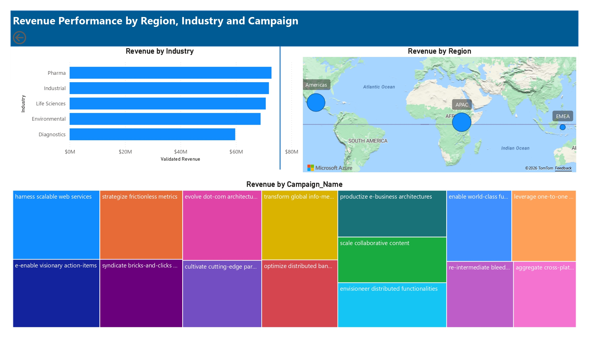
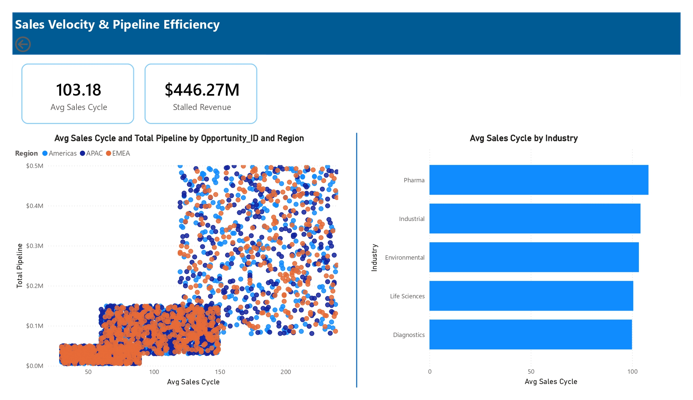
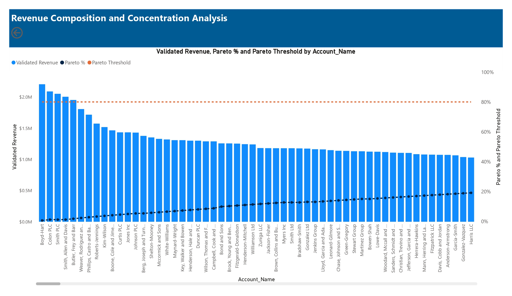
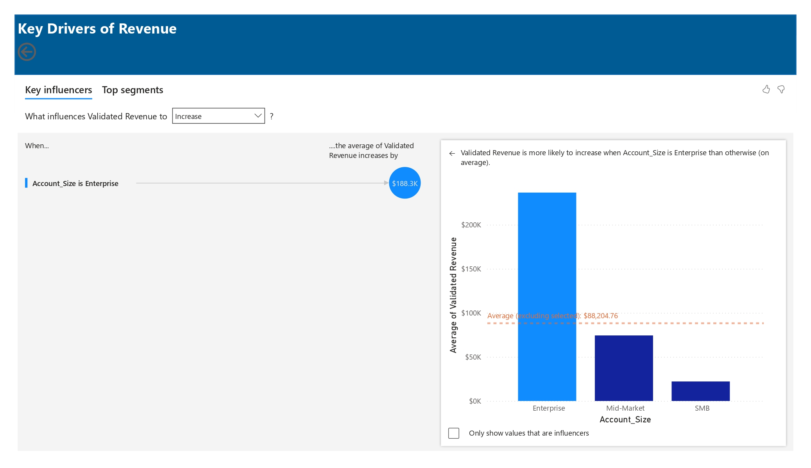
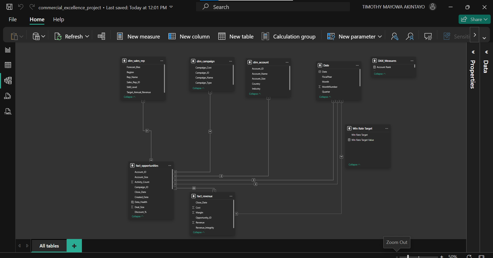

# 📊 From Pipeline to Profit: A Commercial Excellence Intelligence Framework


> A Power BI commercial intelligence framework that transforms raw CRM pipeline data into executive-grade revenue insights, exposing $18M in ghost revenue, diagnosing a $446M pipeline bottleneck, and modelling a $195M revenue unlock through improvement in percentage win rate.

---

## The Business Problem

In most commercial organisations, the CRM is the most important data source, yet it often turns out to be the least trusted with inconsistencies, ghost revenues, opportunities, duplicates and several other anomalies plaguing its reliability. Sales Directors run forecasts on inflated pipelines. CFOs approve budgets based on dirty data. Marketing claims campaign ROI it cannot prove. The pipeline looks healthy on paper and collapses every quarter.

This framework was built to answer the four questions that matter at board level:

- How much of this pipeline is actually forecastable?
- Where is the organisation losing deals it should be winning?
- How much revenue is trapped in stalled pipeline — and what is the financial cost of leaving it there?
- Which accounts are driving real commercial performance, and is the business prioritising them correctly?
- What will be the cost impact of improving our win rate by certain percentage on total pipeline and revenue?
- What are the major drivers of revenue increase and decrease ?

---

## Dashboard Overview

### Page 1 — Pipeline Integrity & Commercial Governance

> *Identifies ghost revenue, validates pipeline quality, and establishes the true forecastable baseline*

### Page 2 — Sales Effectiveness & Discount Optimisation

> *Tracks win rate against strategic target and exposes the relationship between discounting behaviour and close rate*

### Page 3 — Revenue Performance by Region, Industry & Campaign

> *Breaks down validated revenue across commercial segments and measures campaign-to-revenue conversion*

### Page 4 — Sales Velocity & Pipeline Efficiency

> *Identifies where deals are slowing down, which regions convert fastest, and which sectors are creating friction*

### Page 5 — Revenue Composition & Account Concentration

> *Pareto analysis of the account base reveals which 21% of accounts are generating 80% of validated revenue*

### Page 6 — Drivers of Win Rate

> *This identified when revenue is likely to increase. Showed revenue is likely to increase by $188K when account size is enterprise*

### Page 7 — Revenue Recovery & Pipeline Optimisation Simulation

> *Live scenario model — adjust the win rate slider and see the direct financial impact on revenue and total pipeline increase. The starting is at 30% as this helps to cover the 9% left for the benchmarked 30% win rate target out of which the realized was 20.9*

---

## 🔍 Key Findings

### 1. $18M in Ghost Revenue — The Forecasting Blind Spot
1,000 opportunities were recorded as Won but had no closing date. That is $18.02M in ghost revenue. These are commercial activity the business cannot report, forecast, or audit. With ghost revenue excluded, only **16% of the $2.15bn total pipeline** qualifies as Validated Revenue. The business thinks it has a $2.15bn pipeline. However, it has just $344M it can actually act on.

### Action: 
Enforce Mandatory CRM Governance: Implement hard-stop validation rules at the CRM entry point to ensure every 'Won' deal has a timestamp, converting 'Ghost Revenue' into bankable cash.

### 2. 30% Execution Deficit
Win rate is sitting at **20.94% against a 30% strategic target**. Average discount is 20%. The data shows this is not a pricing problem instead it is an execution problem. Discounting at 20% without closing at target rate means the business is surrendering margin without the revenue to justify it.

### Action: 
Launch a 'Win Rate Recovery' Program: Prioritize high-value segments for intensive sales training and competitive audit to close the 9.06% gap between current performance and the strategic baseline.

### 3. $446M Stuck in the Pipeline
**$446.27M is classified as stalled revenue**. These are deals that have exceeded the 103-day average sales cycle (they are over 180 days) and are not won. APAC converts faster than EMEA and Americas. Pharma and Industrial cycles are materially longer than Diagnostics in terms of sales cycle, affecting growth in the exact segments the business is prioritising for expansion.

### Action
Execute a velocity increase mandatory timeline for the sales reps: The leadership team must mandate a 60-day 'Close-or-Kill' review for all stalled accounts over $0.2M to reclaim sales capacity and clear pipeline deadwood.


### 4. $195M Revenue Unlock is Modelled and Quantified
A **9%** improvement in win rate to hit the **30%** strategic target models a **$195.27M** revenue unlock, raising the optimised forecast from $344.09M to $539.36M. This is built directly from the existing pipeline, win rate, and validated revenue, not assumptions.

### Action
Launch a recovery mechanism that prioritizes a competitive audit of lost deals in our top-tier segments to identify why we are failing to convert the nearly $200M in "Found Revenue".

### 5. Enterprise Accounts Drive $188.3K More Revenue on Average
The Key Influencer analysis reveals that Enterprise accounts generate **$188.3K** more in validated revenue than SMB and Mid-Market counterparts. The combination effect is even more telling when the account is Enterprise, campaign type is not Digital Ads, and the region is not Americas, validated revenue increases by $161K on average.Sales effort should be deliberately concentrated on Enterprise accounts outside the Americas, and Digital Ads spend should be interrogated because it consistently appears as a drag on validated revenue, not a driver.

### Action 
Sales effort should be concentrated on Enterprise accounts outside the Americas. Digital Ads appears consistently as a drag on validated revenue. It deserves further investigation into why it is not driving revenue which can be uncovered by collaborating with the marketing team to understand the root cause.

### 6. 80% of Revenue from 21% of Accounts
The Pareto analysis of validated revenue shows extreme concentration. Boyd-Hart, Colton PLC, and a small cluster of named accounts are carrying commercial performance. The remaining 79% of accounts generate 20% of revenue. This is not a portfolio problem, it is a prioritisation problem that the business can act on immediately.

### Action
Launch a key account excellence protocol for the top 21%. Dedicated resource, tailored engagement cadence, and retention-first commercial strategy.
---

## 📈 Metrics Summary

| Metric | Value |
|---|---|
| Total Pipeline | $2.15bn |
| Validated Revenue | $344.09M |
| Ghost Revenue (Won, no close date) | $18.02M |
| Stalled Revenue | $446.27M |
| Win Rate — Actual vs Target | 20.94% vs 30.00% |
| Average Discount | 20.00% |
| Average Sales Cycle | 103.18 days |
| Revenue Unlock (9% win rate % increase) | $195.27M |
| Optimised Validated Revenue Win Rate Increase | $539.36M |
| Revenue Driver | Enterprise account on average generates $188.3K more revenue than SMB and Mid-market |
| Revenue Concentration | 80% from 21% of accounts |

---

## Technical Build

| Component | Detail |
|---|---|
| Tool | Power BI Desktop |
| DAX Measures | 20+ custom measures |
| Dataset | Simulated CRM dataset (~5,000+ opportunity records) |
| Data Problems Modelled | Missing close dates, stalled pipeline, discount-driven wins, forecast misalignment |
| Visuals | KPI cards, bar charts, scatter plots, treemap, Pareto chart, simulation slicer |

**DAX logic covered:**
- Pipeline integrity flags (ghost deal classification, dated vs undated pipeline)
- Win rate tracking vs dynamic target
- Stalled revenue classification based on cycle threshold
- Pareto cumulative % for account concentration
- Revenue unlock simulation with win rate % increase parameter
- Sales cycle variance by region and industry

**Sample Complex DAX:**
**Calculated Date Table**
Built a custom date table to enable time intelligence across the full pipeline lifecycle, including fiscal year tracking offset by 6 months.
```dax
Date = 
ADDCOLUMNS(
    CALENDAR(DATE(2023,1,1), DATE(2026,12,31)),
    "Year",        YEAR([Date]),
    "MonthNumber", MONTH([Date]),
    "Month",       FORMAT([Date], "MMMM"),
    "Quarter",     "Q" & FORMAT([Date], "Q"),
    "YearMonth",   FORMAT([Date], "YYYY-MM"),
    "FiscalYear",  "FY" & IF(MONTH([Date]) >= 7, YEAR([Date])+1, YEAR([Date]))
)
```

**Data Health Classification Engine**
Every opportunity is classified into one of five states using a priority-ordered SWITCH to surface data quality failures before they corrupt forecasts.
```dax
Data_Health = 
SWITCH(TRUE(),
    ISBLANK(fact_opportunities[Close_Date]),
        "GHOST DEAL",
    fact_opportunities[Is_Won] = 1 
        && COUNTROWS(RELATEDTABLE(fact_revenue)) = 0,
        "Revenue Leakage",
    fact_opportunities[Probability] > 80 
        && fact_opportunities[Activity_Count] < 5,
        "SANDBAG RISK",
    fact_opportunities[Sales_Cycle_Days] > 180 
        && fact_opportunities[Is_Won] = 0,
        "STALLED DEAL",
    "Healthy Pipeline"
)
```

| Classification | What It Flags|
|---|---|
| GHOST DEAL | Won opportunity with no close date (unauditable revenue) |
| Revenue Leakage | Won deal with no corresponding revenue record |
|SANDBAG RISK | High probability deal with suspiciously low activity |
|STALLED DEAL | Open deal exceeding 180 days with no close|
| Healthy Pipeline | Passes all integrity checks |


**Pipeline Integrity Measures**
---Count of ghost deals in the pipeline
```dax
Ghost Deals = 
CALCULATE(
    COUNTROWS(fact_opportunities),
    fact_opportunities[Data_Health] = "GHOST DEAL"
)

-- Pipeline value with a valid close date only
Dated Pipeline = 
CALCULATE(
    SUM(fact_opportunities[Deal_Size]),
    NOT(ISBLANK(fact_opportunities[Close_Date]))
)

-- Full pipeline including undated opportunities
Total Pipeline = 
SUM(fact_opportunities[Deal_Size])

-- Revenue recognised but missing a date — excluded from forecast
Unrecognized Revenue = 
CALCULATE(
    SUM(fact_revenue[Revenue]),
    fact_revenue[Revenue_Integrity] = "Unrecognized Revenue (No Date)"
)

-- Validated revenue that passes all integrity checks — the true forecastable baseline
Validated Revenue = 
CALCULATE(
    SUM(fact_revenue[Revenue]),
    fact_revenue[Revenue_Integrity] = "Valid"
)
```

**Revenue Unlock Simulation**
A dynamic what-if model that calculates the financial impact of closing the gap between actual win rate and the 30% strategic target. The win rate slider allows leadership to model revenue impact in real time.
-- Disconnected parameter table driving the scenario slider
```dax
Win Rate Target = GENERATESERIES(0.2, 0.4, 0.01)

-- Reads the slider selection, defaults to current win rate if none selected
Win Rate Target Value = 
SELECTEDVALUE('Win Rate Target'[Win Rate Target], [Win Rate %])

-- Models the revenue unlock from closing the win rate gap against total pipeline
Projected Revenue Unlock = 
[Total Pipeline] * [Win Rate Gap]
```

**Pareto Analysis — Account Revenue Concentration**
Calculates cumulative revenue rank across all accounts to identify the 21% of accounts driving 80% of validated revenue.
-- Cumulative revenue ranked highest to lowest across all accounts
```dax
Running Total Revenue = 
VAR CurrentRank =
    RANKX(
        ALL(dim_account),
        [Validated Revenue],
        ,
        DESC,
        DENSE
    )
RETURN
CALCULATE(
    [Validated Revenue],
    FILTER(
        ALL(dim_account),
        RANKX(
            ALL(dim_account),
            [Validated Revenue],
            ,
            DESC,
            DENSE
        ) <= CurrentRank
    )
)

-- Cumulative revenue as a percentage of total — used to draw the 80% Pareto threshold line
Pareto % = 
DIVIDE(
    [Running Total Revenue],
    CALCULATE([Validated Revenue], ALL(dim_account))
)
```
---


## 💡 From Insight to Action

Every finding in this framework connects to a specific commercial decision.

| Finding | Decision It Enables |
|---|---|
| $18M ghost revenue | Enforce mandatory close-date validation at CRM entry point |
| 30% execution deficit | Investigate whether the gap is rep performance, product-market fit, or process |
| $446M stalled pipeline | Implement a 60-day close-or-kill review for all stalled deals over $200K |
| APAC outperforming on velocity | Identify and replicate the APAC conversion model in EMEA |
| 80/21 account concentration | Launch a key account excellence protocol for the top 21% |
| $195M unlock modelled | Build the business case for improving win rate % |

---

**Data Architecture:**
```
Star Schema Design:
├── Fact Tables
│   ├── fact_opportunities (20,000+ rows) — pipeline, discount, deal value, close dates
│   └── fact_revenue — revenue, cost, margin
└── Dimension Tables
    ├── dim_date — time intelligence, sales cycle calculations
    ├── dim_sales_rep — rep-level performance tracking
    ├── dim_account — account size, region, industry classification
    └── dim_campaign — campaign type, campaign name 
```



---

## 🗂️ Repository Structure

```
CRM-Commercial-Excellence/
│
├── README.md
│
├── data/
│   ├── fact_opportunities.csv
│   ├── fact_revenue.csv
│   ├── dim_account.csv
│   ├── dim_campaign.csv
│   └── dim_sales_rep.csv
│
├── dashboard/
│   └── CRM_Commercial_Excellence.pbix
│
├── docs/
│   └── commercial_excellence_project.pdf
│
└── images/
├── pipeline_integrity.jpg
├── sales_effectiveness.jpg
├── revenue_performance.jpg
├── sales_velocity.jpg
├── account_concentration.jpg
├── revenue_driver.jpg
└── revenue_simulation.jpg

```

---

## Author

**Timothy**
Data Analyst

[](https://www.linkedin.com/in/timothy-akintayo)
[](https://timothyakintayo.github.io)

---

> *Built to simulate and solve the real-world CRM data problems that make commercial revenue unforecastable, produce pipeline integrity failures, execution gaps, stalled deals, and account concentration risk. The goal was not a dashboard. It was a decision tool.*
